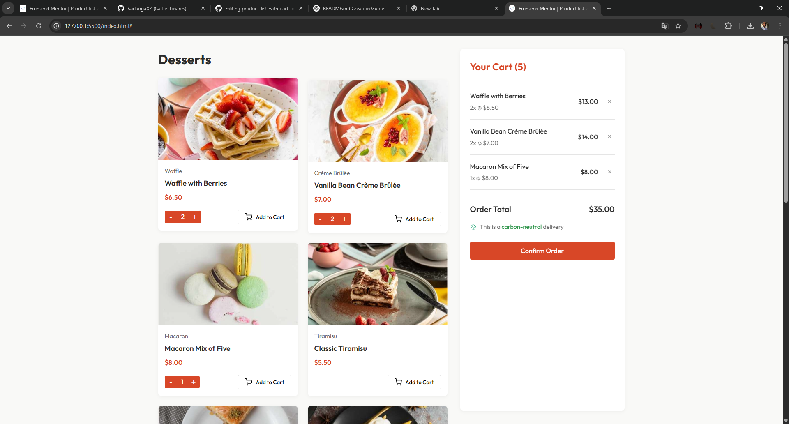

# Frontend Mentor

# 🛒 Product List with Cart

A web application where users can view a list of products and add them to a shopping cart.

 <!-- Optional: Add a screenshot if you have one -->

## 🚀 Features

- Browse a list of products
- Add products to the cart
- View cart items
- Remove products from the cart
- See total cart price

## 🛠️ Technologies Used

- **HTML**
- **CSS**
- **JavaScript**

## 📂 Project Structure
```
product-list-with-cart-main/
│
├── index.html       # Main HTML file
├── style.css        # Stylesheet
├── script.js        # JavaScript functionality
└── README.md        # Project documentation
```
## 🎯 Future Improvements
- Persist cart data using local storage

- Add product images

- Improve responsiveness for mobile devices

- Implement product quantity management

## 🤝 Contributing
Contributions are welcome! Feel free to fork this repository and submit a pull request.
